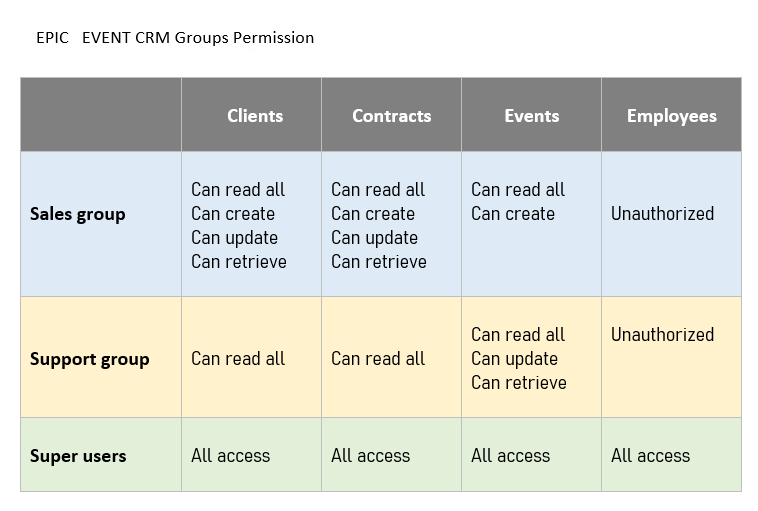

# Project 12 - CRM EPIC EVENTS


 #### This project is a Backend secured CRM  :

- Stack used: Django, Django REST Framework.
- Authentication library: Django REST Framework simple JWT (use JSON Web Token)
- Code linter tools : Flake 8html
- My Python version : 3.10.1

- A user can login,
- All authencticated users can read clients, contracts or events.
- But for add , retrieve or update those instances :
  - user must have the right permission.

 #### User permissions :




## Installation

#### clone repository locally :

```bash
git clone https://github.com/Rossignol-h/P12_Epicevent_Rossignol_Hanane.git
```

#### open your terminal at the root of the project :

```bash
P12_Epicevent_Rossignol_Hanane-main # This path
```

#### Create a virtual environment :

```bash
python -m venv env   # on Windows
python3 -m venv env  # on Mac or Linux
```

#### Activate the virtual environment :
```bash
./env/Script/activate  # on Windows
./env/bin/activate     # on Mac or Linux
```

#### Install all dependencies from the file 'requirements.txt' :
```bash
pip install -r requirements.txt
```
#### open your terminal at the root of the app  :

```bash
cd backend
```

#### Generate the SQlite database :
```bash
python manage.py migrate
```

#### Run the server :
```bash
python manage.py runserver
```

## Usage 

#### The previous command will automatically generate a link :
```bash
Starting development server at http://127.0.0.1:8000/  
```

#### Click on that link it will open on your default browser :

But to access the first step of using this API go to :

```bash
http://127.0.0.1:8000/login/ 
```

## Documentation  

#### 1 - Please read the documentation on POSTMAN:

[https://documenter.getpostman.com/view/23330358/2s8YzL56X9](https://documenter.getpostman.com/view/23330358/2s8YzL56X9)

## Testing API 

#### 2 - You can test all the endpoints on POSTMAN: 
- Login or Signup to your POSTMAN account.
- Now you're ready to send some requests !
- For speed up the process I write for you a bunch of data in "data.txt" file :
- Employees, clients , contract, events in JSON format
- just copy and paste in the field "RAW"
- follow the documentation and enjoy ;)

## Check if the code respect the style guide for Python (PEP8)

#### For generate a Flake 8 html report :
```bash
flake8 --format=html --htmldir=flake-report
```

#### Now you have in the new generated flake-report folder an index.html file :

open the file index.html in your default browser

## Author

- By Rossignol Hanane 2022-2023 
- Github Profile :octocat: [@Rossignol-h](https://github.com/Rossignol-h)